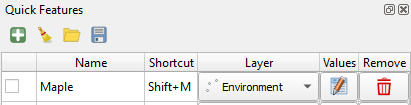
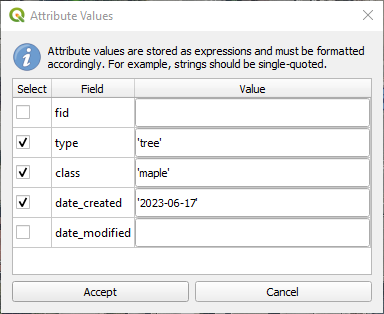
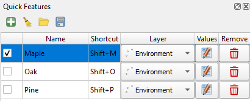

⚡ Quick Features - QGIS Plugin
======================================================================================================
 

A QGIS plugin for speeding up manual feature creation and digitization. By linking feature templates to keyboard shorcuts,
the user saves on clicks and keystrokes when repetitively switching between feature types.

This plugin was originally created to facilitate the labelling of training data from imagery, although it can
be applied to other use cases as well.

# Installation

Follow [this guide](doc/installation.md) for instructions on installing the plugin.

# How to use this plugin

## Feature templates

The plugin implements _feature templates_, which define attribute values for a given vector layer. The user can 
switch between feature templates using keyboard shortcuts. An active feature template will suppress the 'Add Feature Form'
and auto-fill attribute values when a feature is created.

## Create a feature template

To create a feature template, hit the  button. Give the new template a name, shortcut,
and select a map layer.

_NOTE: Keyboard shortcuts must be typed out. For example, if you wanted a combination of keystrokes like
'Ctrl+D' or 'Shift+D', you must type that out instead of just hitting the keys._

## Set the feature template's attribute values

Once a map layer has been selected, hit the  button. Here, you can enter the
attribute values for this template. Any new feature created using the template will have its attributes auto-filled
according to these values.

Begin by clicking the checkboxes for the fields for which values should be set. Unselect fields will be ignored.

Enter the desired values. _IMPORTANT: these values are stored as [expressions](https://docs.qgis.org/3.28/en/docs/user_manual/expressions/expression.html),
and should be formatted accordingly._ For instance:
- Integer and float values can be entered as-is: `6`, `2.123`
- String values should be single-quoted: `'John Smith'`
- Dates should be single-quoted and follow the YYYY-MM-DD format: `'2023-06-18'`

### Activate the feature template

The template can be activated, either by click its checkbox or by hitting its keyboard shortcut.

