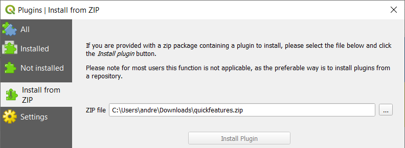

# ⚡ Quick Features - QGIS Plugin

This QGIS plugin speeds up workflows that involve high volumes
of manual feature creation.

Quick Feature Create implements _feature templates_ which define attribute 
values for a given vector layer. The user can activate feature templates using
keyboard shortcuts. An active feature template will auto-fill attribute values
when a feature is created, thus saving clicks and keystrokes and speeding up
 digitization. 

## License

Distributed under the terms of the [`GPLv3` license](LICENSE).

## Installation

### Method 1: Download latest release

Download the [latest release](https://github.com/andrew-plowright/quickfeatures/releases/latest).

In QGIS 3, click _Plugins_ in the menu bar, then _Manage and Install Plugins_. In the
left-hand panel, click _Install From Zip_ and
select the downloaded zip file to install the plugin.

### Method 2: Clone from Github

Clone this repository to your local machine.

In QGIS 3, click _Settings_ in the menu bar, then _Options_. In the left-hand panel, click _System_, then
scroll down to the _Environment_ section.

Add a new environment variable named `QGIS_PLUGINPATH`. Set it to
_Append_ and set its value to the path to the cloned repository (the folder in which this README.md file is
located).

Restart QGIS.

Then, click _Plugins_ in the menu bar, then _Manage and Install Plugins_. You should now find
"Quick Features" in the list of available plugins.